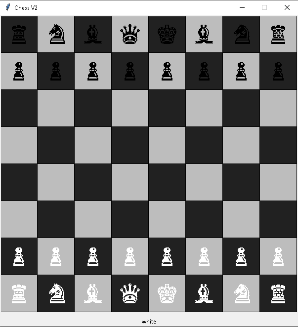

# Chess-V2
A simple Chess game made with Python3

## Usage:

```bash
python3 chess.py
```

[](https://github.com/sandmanscanga/Chess-V2)

## Credits:
[Adam Scanga](https://github.com/sandmanscanga)
[Curtis Lane](https://github.com/CurtisLane)